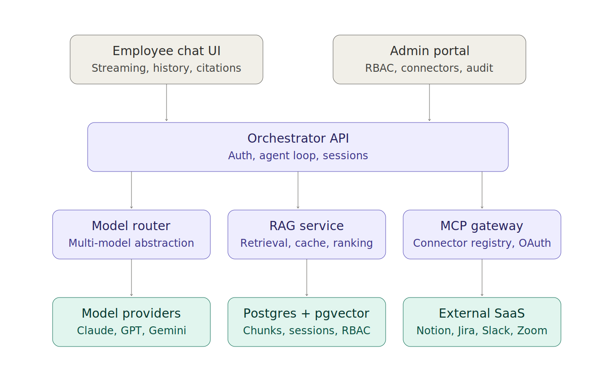
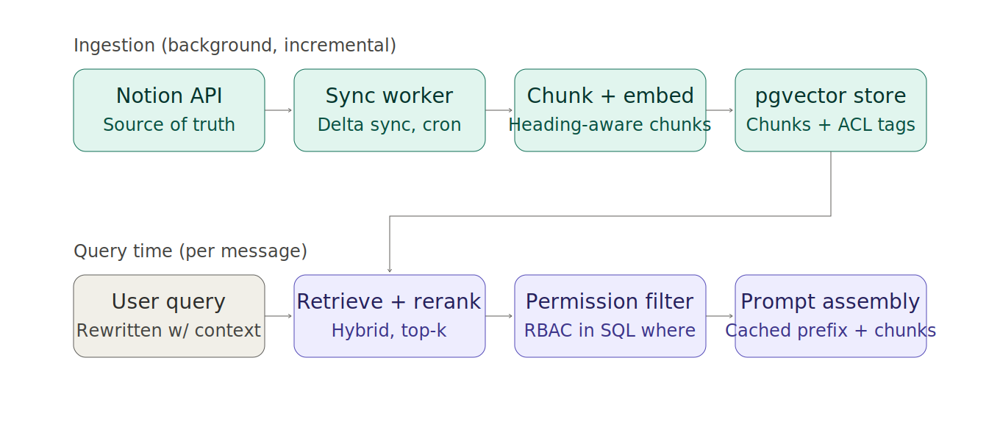

# 🧩 Internal AI Assistant — Architecture (SKILL.md)

Source: [Notion — Ask WEKA Project Plan](https://app.notion.com/p/3c330b0d101c81f69f83d13f61b4125e)

**Reference architecture and build plan** for an internal AI assistant covering knowledge base search, ticket creation, Notion documentation, Zoom, and a general MCP connector layer — with a manager/admin control plane and a Claude-like chat experience.

**Foundation choices:** multi-model abstraction layer (not locked to one provider), Notion as the primary KB source, deployment on Replit.

---

## 1. System overview

Layers, top to bottom:

1. **Employee chat UI** — streaming responses, conversation history, citations back to source articles.
2. **Admin portal** — RBAC config, connector management, audit log, usage dashboards.
3. **Orchestrator API** — auth, the agent/tool-calling loop, session state.
4. **Model router** — abstraction layer so the orchestrator can call Claude, GPT, Gemini, etc. interchangeably.
5. **RAG service** — retrieval, permission filtering, prompt assembly, caching.
6. **MCP gateway** — connector registry, per-user OAuth, tool policy enforcement.
7. **Data & providers** — model provider APIs, Postgres + pgvector, external SaaS tools.



---

## 2. Context engineering

### Ingestion

- Notion is the source of truth. A sync worker (Replit Scheduled Deployment) polls the Notion API using `last_edited_time` to pick up deltas only.
- Convert blocks to markdown, chunk on heading boundaries (~500–1000 tokens, slight overlap).
- Store per chunk: source page ID, department, URL, last-updated timestamp, and **ACL tags**.
- Handle deletions and permission changes on every sync — a revoked page lingering in the vector store is a data leak.

### Storage

- Single Postgres database (Replit's built-in Postgres / Neon) with `pgvector`.
- Core tables: `articles`, `chunks` (embedding vector + HNSW index), `conversations`, `messages`, `users`, `roles`, `connector_tokens`, `audit_log`.
- Keep ACL columns next to embeddings so permission checks happen in the same SQL query as retrieval.

### Retrieval

- Hybrid search: vector similarity + Postgres full-text (`tsvector`), merged with reciprocal rank fusion.
- Rewrite the user's query with a cheap model first, using conversation context.
- Enforce RBAC as a `WHERE` clause in the vector query itself.

### Caching (three layers)

1. **Embedding cache** — skip re-embedding unchanged chunks.
2. **Prompt cache** — stable system prompt prefix for provider-side caching.
3. **Semantic answer cache** (optional) — cache validated answers for high-frequency questions.

### Prompt structure

```
system prompt (identity, rules, citation requirements)
  → tool definitions
  → retrieved chunks (tagged, with source URLs)
  → conversation history
  → current user message
```



---

## 3. Integrations (MCP layer)

- Every integration registered as an MCP server with a manifest: name, tools, required scopes, allowed roles.
- Notion serves double duty: **RAG source** (read path) and **tool** (write path — create documentation pages).
- **Reads** execute automatically. **Writes** (tickets, pages, messages) get a confirm-before-execute step, logged to `audit_log`.
- Zoom via MCP/API for scheduling + transcript retrieval.
- Ticket creation: draft → user confirms → create in Jira/ServiceNow.

---

## 4. Manager / admin portal

- **Roles** mapped from IdP groups (SSO via Google Workspace/Okta OIDC).
- **KB scopes** — which departments' articles each role can retrieve.
- **Connector policies** — which MCP servers/tools each role can invoke; org-wide enable/disable.
- **Audit** — every tool call logged with user, input, output, timestamp.
- **Usage dashboards** — queries per department, deflection rate, unanswered-question log.
- **"Test as role"** impersonation mode.

---

## 5. Assistant experience

- Token streaming over SSE, auto-titled conversations, markdown with citation links.
- Visible tool-use states ("Searching knowledge base…", "Creating Jira ticket…").
- Multi-turn context: full history up to a budget (~20–30 messages), then summarize older turns, keep the recent tail verbatim.
- Persist every message to Postgres.
- Cross-session memory (team, preferences) as a later-stage addition.

---

## 6. Deployment notes (Replit)

- Reserved VM for the main app (persistent streams, background jobs).
- Scheduled Deployment for the Notion sync worker.
- Replit Secrets for API keys and OAuth client secrets.
- Built-in Postgres with `pgvector`.
- Encrypt stored OAuth tokens at the application layer — envelope encryption, key in Secrets.

---

## 7. Suggested build order

1. Chat UI + orchestrator + single model, streaming + history.
2. Notion sync + RAG with citations.
3. SSO + RBAC-filtered retrieval.
4. MCP gateway with first two tools (Jira tickets, Notion page creation).
5. Admin portal + audit log.
6. Multi-model routing, caching optimizations, Zoom, semantic cache.
